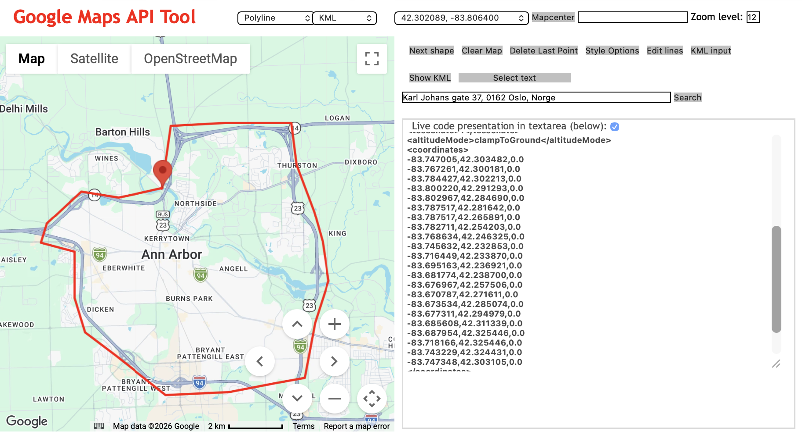
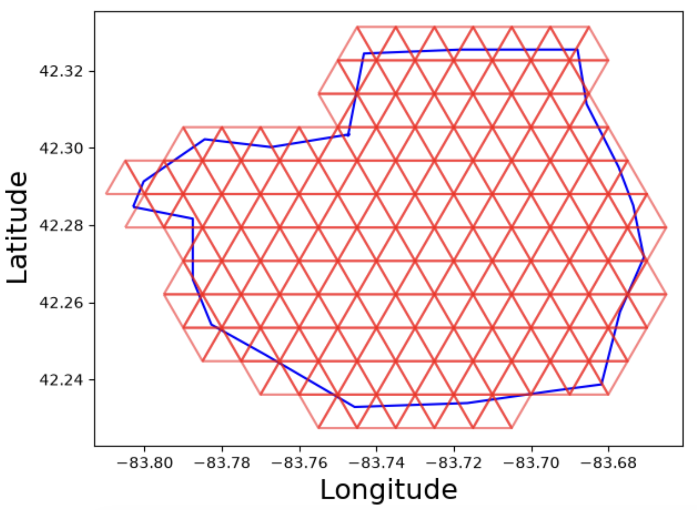
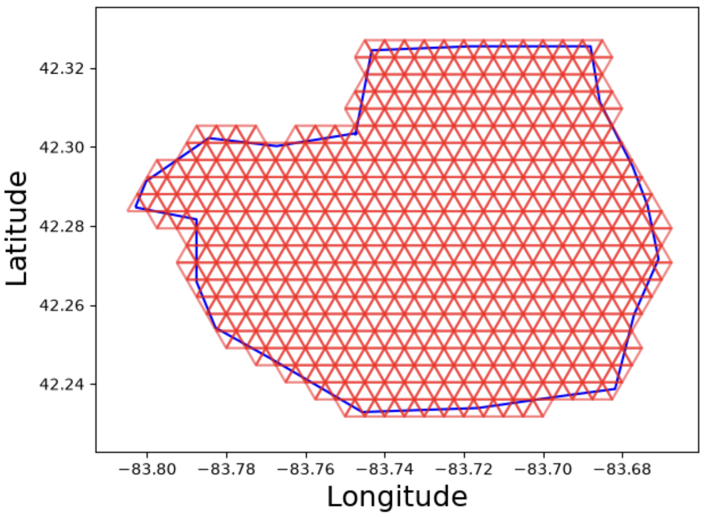

# Data preprocessing
DREEMS requires three mandatory inputs: a grid, sample coordinates, and a zarr array containing LD-pruned SNPs. This tutorial will go over the preprocessing procedure for each input. The data should be LD pruned prior to converting to a zarr array.

## Creating a zarr array from VCF
If you already have a compressed VCF file, you may skip the function `pysam.tabix_compress`.

```python
import pysam
from sgkit.io.vcf import vcf_to_zarr

vcf = "example.vcf"
vcf_gz = vcf_file + ".gz"

# Step 1: Compress the VCF using bgzip (if not already compressed)
pysam.tabix_compress(vcf_file, vcf_gz, force=True)

# Index the bgzipped VCF file
pysam.tabix_index(vcf_gz, preset="vcf", force=True)

# Convert to zarr file
vcf_to_zarr(vcf_gz, "./example.zarr")
```

## Creating a zarr array from PLINK
```python
from bio2zarr import plink2zarr

# Path to your PLINK prefix (expects prefix.bed, prefix.bim, prefix.fam)
plink_prefix = "path/to/my_data"
output_zarr = "path/to/output.zarr"

# Convert PLINK to VCF-spec Zarr
plink2zarr(
    input_prefix=plink_prefix,
    output_path=output_zarr
)
```

## Grid creation
The input for DREEMS requires a user-defined grid over a geographic region. We recommend using a triangular lattice grid. If the user already has a pre-defined grid, then they can pass in a `grid` variable that stores every node coordinate as (longitude, latitude) pairs. For users that do not have an already constructured grid, here's how you can construct one. Please click on [this link](https://www.birdtheme.org/useful/v3tool.html) that will open up a map.

On the map, you can scroll around and zoom in on your region of interest. For example, suppose you are interested in the region around the University of Michigan (Go Blue!). You navigate to Michigan, then click around the region of interest, and form an outer polygon around Ann Arbor. The coordinates of every point will be on the right hand side.



Now you can copy the list of coordinates and ask your favorite AI tool to reformat it into an array of coordinate pairs and drop the column of 0's.

```python
outer = [
  [-83.747005, 42.303482],
  [-83.767261, 42.300181],
  [-83.784427, 42.302213],
  [-83.800220, 42.291293],
  [-83.802967, 42.284690],
  [-83.787517, 42.281642],
  [-83.787517, 42.265891],
  [-83.782711, 42.254203],
  [-83.768634, 42.246325],
  [-83.745632, 42.232853],
  [-83.716449, 42.233870],
  [-83.695163, 42.236921],
  [-83.681774, 42.238700],
  [-83.676967, 42.257506],
  [-83.670787, 42.271611],
  [-83.673534, 42.285074],
  [-83.677311, 42.294979],
  [-83.685608, 42.311339],
  [-83.687954, 42.325446],
  [-83.718166, 42.325446],
  [-83.743229, 42.324431],
  [-83.747348, 42.303105]
]
```

Now to construct the grid, you must pick a grid size. To do so, you can use the function `draw_grid` to visualize what grid size works best. This function will use the outer polygon and automatically generate a best fitting triangle lattice. The parameter `grid_size` determines the length of each triangle. If your region spans a small geographic area, then the grid size needs to be small, and vice versa. `pad` is only used for plotting purposes to determine how much you want to zoom out on the figure. 

```python
G = create_grid(outer, grid_size=0.01, pad = 0.01)
# Here we created a grid with 147 nodes with 392 edges.
```



If you want a much denser grid, all you have to do is make your triangles smaller in `grid_size`.

```python
G = create_grid(outer, grid_size=0.005, pad = 0.01)
# Here we created a grid with 478 nodes with 1346 edges.
```



Once you are satisfied with the density and location of your grid. Extract the `nodes` variable that describes the coordinates of each grid node and `edges` variable that describes how each node of the grid are connected. In general, if your have a sparsely spread out dataset, you should use a sparser grid. If you have samples well spread out across the grid, with high sample size and molecular density, then having a dense grid is appropriate. The `nodes` and `edges` variable will be necessary inputs to DREEMS.

```python
nodes = np.array([list(coord) for coord in nx.get_node_attributes(G, 'pos').values()])
edges = G.edges
```

## Formatting sample coordinates
Sample coordinates must be provided as a dictionary that maps sample identifiers to (longitude, latitude). Note that these sample identifiers MUST match those used in the input Zarr file.

An example of a valid `sample_coordinates` object:
```python
sample_coordinates = {'sample_1': (np.float64(-87.53528), np.float64(35.46333)),
 'sample_2': (np.float64(-86.893962), np.float64(35.597185)),
 'sample_3': (np.float64(-83.9299), np.float64(35.8188)),
}
```